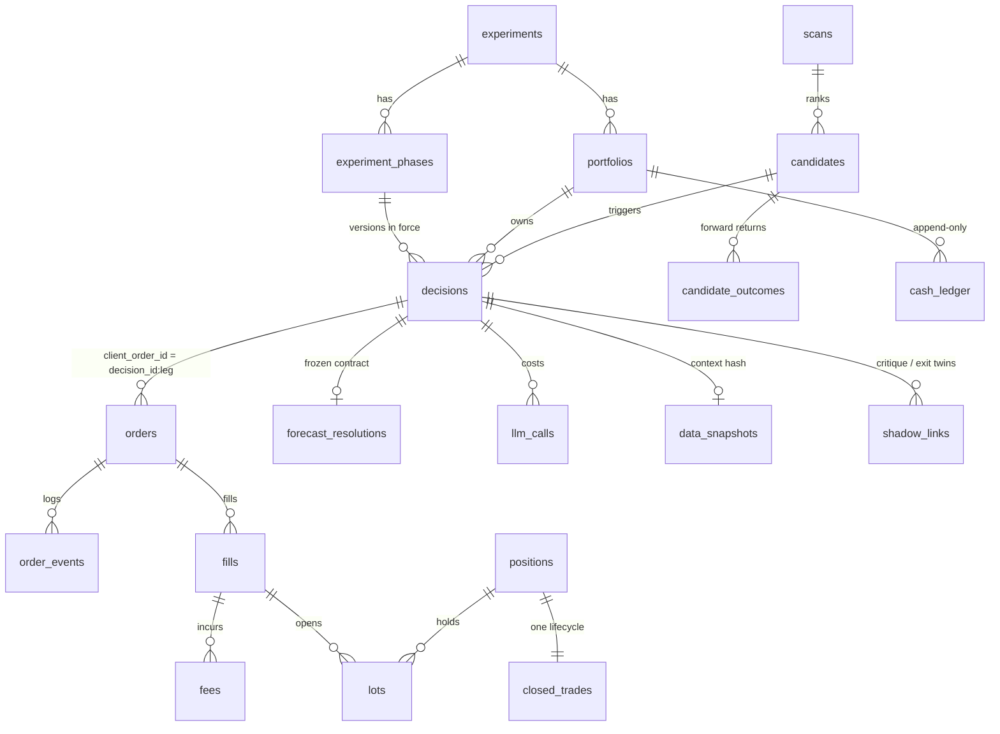

# Supabase / Postgres schema summary

Migrations: `supabase/migrations/20260913000001…08_*.sql`. Applied clean on PostgreSQL 16.13; 42 tables, 33 enums,
12 trigger functions; RLS enabled on every table (service-role access only). Ledger style: ADR-0002.

## Table groups (§10.1)
| Group | Tables | Notes |
|---|---|---|
| Experiment | `experiments`, `experiment_phases`, `portfolios`, `prompt_versions`, `config_versions`, `scanner_versions`, `qb_rules_versions`, `exclusion_list_versions` | one open phase per experiment (partial unique index); one primary and one broker-facing portfolio per experiment; `experiments.live_locked_out` CHECK |
| Market | `instruments`, `universe_memberships`, `regimes`, `scans`, `candidates`, `candidate_outcomes`, `source_status`, `benchmark_prices` | `candidates` carries `signal_bar_time`, `signal_observed_at`, `sip_signal_*`, IEX price + age at scan/triage/decision/order (D-50); `scans.bars_end_at ≤ started_at` |
| Decisions | `data_snapshots`, `decisions`, `decision_sources`, `llm_calls` | full §7.6 column set; five NOT NULL version FKs; `pre_critique_proposal` jsonb; `raw_model_output` |
| Execution | `positions`, `orders`, `order_events`, `fills`, `lots`, `lot_events`, `cash_ledger`, `fees`, `stop_coverage`, `reconciliations`, `owner_resolutions`, `halts`, `broker_policy_checks`, `budget_ledger`, `approvals` | `client_order_id` UNIQUE; `broker_order_id`, `broker_fill_id`, `order_events.broker_event_id` UNIQUE (idempotent replay) |
| Analytics | `forecast_resolutions`, `closed_trades`, `shadow_links`, `cost_periods`, `analysis_reports`, `notifications` | `closed_trades` has every §10.1/§13.3 column incl. both P&L views, cost categories, `overnight_gap_exposure`, `post_exit_return_{1,5}s_pct`, `time_in_loss_seconds` |

## Invariants and where they are enforced (§10.2)
| Invariant | Mechanism | Test |
|---|---|---|
| portfolio/experiment/phase on every decision, order, fill, closed trade | NOT NULL + FK; `decisions_check_phase` (phase open, same experiment, versions equal) | test_version_drift_from_phase_rejected, test_prompt_bump… |
| Unique `client_order_id` | UNIQUE (≤128 chars) | test_client_order_id_unique |
| No physical deletes | `forbid_delete` on 24 tables; `forbid_update` on event tables | test_no_physical_deletes (7 tables) |
| State transitions validated | `orders_validate_transition` (§8.4 table) → `order_events` with reason; terminal states locked | test_illegal_transition_rejected, test_legal_transitions_logged |
| `fill_at ≥ order_eligible_at` (simulated) | `fills_check_eligibility` raises `ANTI_LOOK_AHEAD_VIOLATION`; broker fills flagged `eligibility_anomaly` | test_simulated_fill_before_eligibility_rejected, test_broker_fill_before_eligibility_is_flagged_not_rejected |
| `order_eligible_at ≥ signal_observed_at`; `= risk_validation_completed_at` | CHECKs `decisions_eligible_after_signal`, `decisions_eligible_equals_validation`; orders must copy the decision's value | test_decision_eligible_before_signal_rejected, test_order_eligibility_must_match_decision |
| UTC timestamps | `timestamptz` everywhere; app writes UTC | convention |
| Version columns non-null | NOT NULL + FKs to registries | test_versions_non_null |
| Forecast contract immutable; resolution against entry levels from `fill_at` | `decisions_immutable_columns`; `forecast_resolutions_check_contract`; resolutions append-only | test_forecast_contract_immutable, test_working_levels_can_move_but_resolution_uses_entry_levels |
| Cash never negative; ledger chains | CHECK `balance_after_usd ≥ 0`; `cash_ledger_check_chain` | test_cash_ledger_never_negative_and_chains |
| Shadows never touch the broker | `fills_check_broker_portfolio`; partial unique indexes on `portfolios` | test_shadow_portfolio_cannot_receive_broker_fill |
| SHORT/COVER always rejected; NO_ACTION reason; earnings plan; entries carry the contract | CHECKs on `decisions` | tests in test_db_invariants.py |
| No spread double count | `fills_check_eligibility` (`SPREAD_DOUBLE_COUNT`) | test_spread_double_count_rejected |
| LIVE unreachable | `experiments` CHECK; `PENDING_APPROVAL` refused by the transition trigger | test_live_experiment_rejected, test_pending_approval_unreachable |
| Order equals decision (§2) | `orders_check_decision` (symbol, portfolio, side, status, eligibility) | test_sell_entry_order_forbidden |

## Broker status mapping (Alpaca → §8.4)
`accepted`, `pending_new`, `new`, `accepted_for_bidding`, `held` → `SUBMITTED`; `partially_filled` → `PARTIALLY_FILLED`;
`filled` → `FILLED`; `canceled`, `replaced` (reason recorded) → `CANCELLED`; `rejected` → `REJECTED`; `expired`,
`done_for_day` → `EXPIRED`; `pending_cancel`/`pending_replace` are transient and not stored as states.

## ERD (core)

## Analysis inputs already in the schema (§13.3 checklist)
Total return, drawdown, MFE/MAE (`closed_trades`); benchmark returns over `[fill_at, exit_fill_at]`; Brier inputs
(`probability_pre/post_critique`, `forecast_outcome`, `AMBIGUOUS` flag); strategy / regime / catalyst / holding bucket /
earnings plan / phase slices; exit diagnostics (`post_exit_return_1s/5s_pct`, `time_in_loss_seconds`,
`gap_slippage_past_invalidation_pct`); research-grade correlation (`research_grade_cited`, `news_cited`,
`source_grades_used`); fill error (`fills.paper_fill_minus_shadow_estimate_bps`); blind-interval cost
(`decisions.signal_to_order_move_pct`, `blind_interval_move_pct`, `no_action_reason`, `candidate_outcomes`); critique and
exit value (`shadow_links`, shadow portfolios' `closed_trades`); zero-activity days and NO_ACTION frequency
(`decisions`, `scans`).

## Storage
Bucket `decision-context` (private): `data_snapshots.storage_path`, pruned after 90 days by a job that sets
`storage_pruned_at` and touches nothing else (§10.4).
